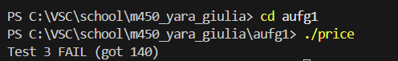

## Übung 1

### Welche Formen von Tests kennen Sie aus der Informatik?
Functional:
- End to end testing
- Integration testing
- Component testing
- Unit testing
  
Non functional:
- Performance
- Reliability
- Security
- Usability
- Stress test

### Nennen Sie ein Beispiel eines SW-Fehlers und eines SW-Mangels.
Fehler: Falsche Daten von API endpoint erhalten. 
Mangel: Erhaltene Daten werden im falschen Format angezeigt.

Beispiel:
Es werden falsche Aktienpreise angezeigt/nicht geupdated. Kunden investieren viel Geld durch eine Täuschung.

### Eine Software gliedert sich in der Regel in eine Reihe von Teilsystemen, die wiederum aus einer Vielzahl elementarer Komponenten besteht. Wir haben im V-Modell gesehen, dass es verschiedene Teststufen gibt. Wir wollen in diesem Zusammenhang nun ein Beispiel der untersten Stufe anschauen.

Untere Teststufen der Pyramide sind Componenet testing und Unit testing. 

### Aufgabe 3
