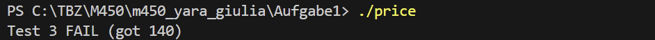

## Aufgabe 1

### Welche Formen von Tests kennen Sie aus der Informatik?
Functional:
- End to end testing
- Integration testing
- Component testing
- Unit testing
  
Non functional:
- Performance
- Reliability
- Security
- Usability
- Stress test

## Aufgabe 2
### Nennen Sie ein Beispiel eines SW-Fehlers und eines SW-Mangels.
Fehler: Falsche/Fehlende Daten von API Endpoint erhalten.
Mangel: Erhaltene Daten werden im falschen Format angezeigt. Die Anforderung des korrekten Formats ist nicht erfüllt.

Beispiel:
Es werden falsche Aktienpreise angezeigt/nicht geupdated. Kunden investieren viel Geld durch eine Täuschung.

## Aufgabe 3
The tests are found [here](main.cpp)

