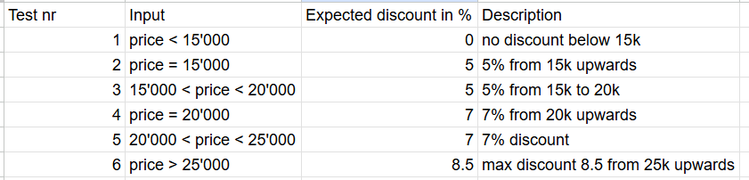
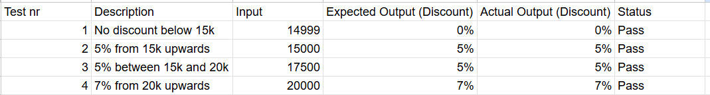

### Aufgabe 1

https://docs.google.com/spreadsheets/d/1liUYalJp3JSJVSdvO34bT7quns00-Lz-oND2Ksr8HvY/edit?usp=sharing

### Aufgabe 2
Definieren Sie *funktionale Black-Box Tests*, die Sie brauchen, um diese Plattform zu betreiben.  
*Listen Sie die 5 wichtigsten Testfälle auf*

| ID | Beschreibung               | Erwartetes Resultat               |Effektives Resultat               |Status               |Mögliche Ursache               |
|-----------|-------------------------|-------------------------|-------------------------|-------------------------|-------------------------|
|   1     | Website loads successfully | NAfter entering the URL in the browser, the homepage opens and displays car rental options.| Website fails to load, showing “502 Bad Gateway.” | Error |Server downtime or network configuration issue |
|   2     | Search for available cars | After selecting “Zurich” and rental dates, a list of available cars appears.|No cars are displayed; page keeps loading. | Error |API call to database failed or timeout occurred |
|   3     | Booking form submission | After filling in customer details and clicking “Continue,” user is redirected to payment page.| User remains on same page, no confirmation or redirect. | Error |Form validation or backend request issue |
|   4     | Responsive design on mobile | When opening the website on a smartphone, layout adapts to screen size and remains usable. | Page layout breaks; buttons overlap on small screens. | Error |Missing or incorrect CSS media queries  |
|   5     | Secure connection (HTTPS) | The website should automatically use HTTPS and show a valid SSL certificate. | Browser warning: “Connection not secure.” | Error |SSL certificate expired or misconfigured |

### Aufgabe 3
Black Box Testcases:
- Do the inputs work?
- What happens when invalid input is used
- Test all inputs
- Is it case sensitive?

White Box Testcases:
- getExchangeRate()

Improvements:
A lot of methods have a user input in them, i recommend receiving the input as a parameter. This can make the code a lot cleaner, as there is only one place where the user input is handled and the methods can be tested better with unit tests.

The code can be found [here](./exc3/)
