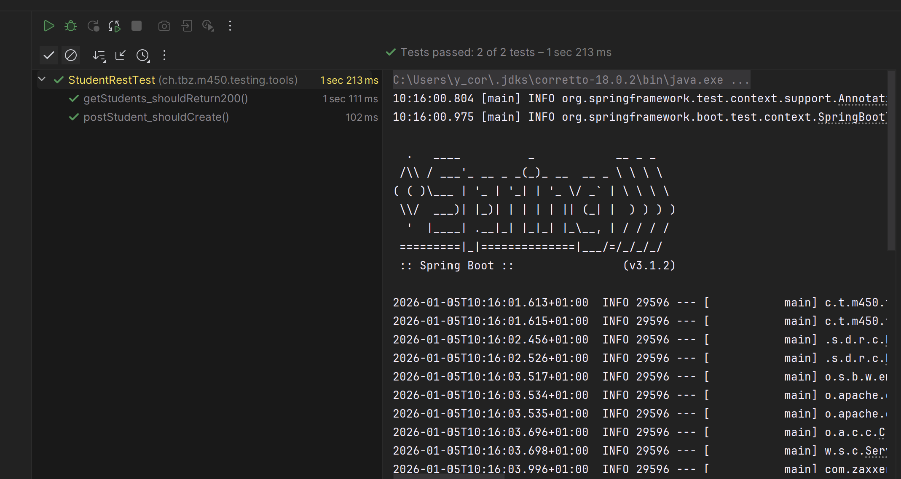
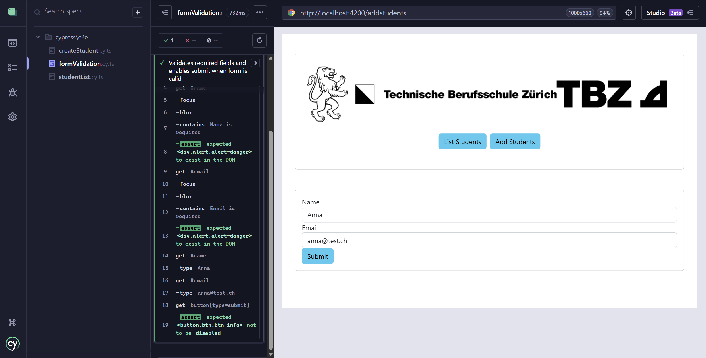
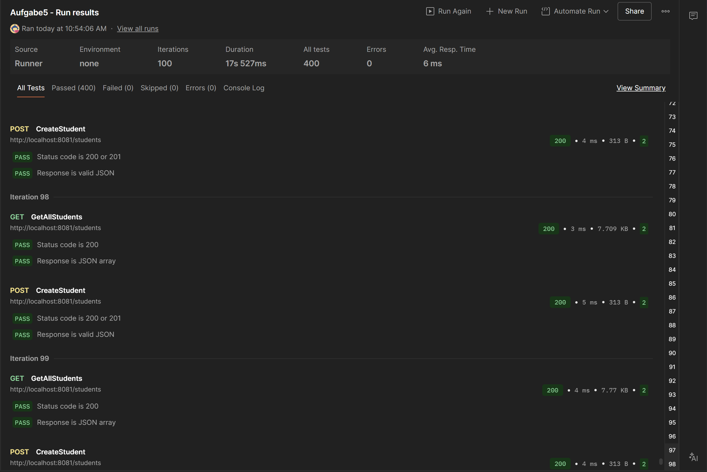

# Automation-Testing
## Aufgabe 1 

To test REST-Endpoints I choose to use JUnit testing.
I tested the endpoint `"/students"` for the GET-Method StatusCode and CREATE-Method
````java
package ch.tbz.m450.testing.tools;

import ch.tbz.m450.testing.tools.repository.entities.Student;
import org.junit.jupiter.api.Test;
import org.springframework.beans.factory.annotation.Autowired;
import org.springframework.boot.test.context.SpringBootTest;
import org.springframework.boot.test.web.client.TestRestTemplate;
import org.springframework.boot.test.web.server.LocalServerPort;
import org.springframework.http.*;

import static org.assertj.core.api.Assertions.assertThat;

@SpringBootTest(webEnvironment = SpringBootTest.WebEnvironment.RANDOM_PORT)
class StudentRestTest {

    @LocalServerPort
    private int port;

    @Autowired
    private TestRestTemplate rest;

    private String url(String path) {
        return "http://localhost:" + port + path;
    }

    @Test
    void getStudents_shouldReturn200() {
        ResponseEntity<String> response = rest.getForEntity(url("/students"), String.class);

        assertThat(response.getStatusCode()).isEqualTo(HttpStatus.OK);
        assertThat(response.getBody()).isNotEmpty();
    }

    @Test
    void postStudent_shouldCreate() {
        Student s = new Student("David", "david@tbz.ch");

        ResponseEntity<Void> response = rest.postForEntity(url("/students"), s, Void.class);

        assertThat(response.getStatusCode()).isEqualTo(HttpStatus.OK);

        // now check count
        ResponseEntity<Student[]> all = rest.getForEntity(url("/students"), Student[].class);
        assertThat(all.getBody().length).isPositive();
    }
}
````



## Aufgabe 2
As a Frontend Test tool, I choose to use cypress.
I mocked the backend for the tests. 

````typescript
describe('Student List', () => {

  it('Should display a list of students', () => {
    cy.intercept('GET', 'http://localhost:8081/students', [
      { id: '1', name: 'Max Muster', email: 'max@test.ch' },
      { id: '2', name: 'Lisa Beispiel', email: 'lisa@test.ch' }
    ]).as('getStudents');

    cy.visit('/students');
    cy.wait('@getStudents');

    cy.contains('Max Muster').should('exist');
    cy.contains('lisa@test.ch').should('exist');
  });

});
````



## Aufgabe 3
Using Postman, I created 2 Test.
Here is the [Postman-Collection](Aufgabe5.postman_collection.json)

### GET-Test (GetAllStudents)
Endpoint:`"http://localhost:8081/students"`

Response:
List of all students
Example: 
````json
[
    {
        "id": 1,
        "name": "Jonas",
        "email": "jonas@tbz.ch"
    },
    {
        "id": 2,
        "name": "Patrick",
        "email": "patrick@tbz.ch"
    },
    {
        "id": 3,
        "name": "Yves",
        "email": "yves@tbz.ch"
    },
    {
        "id": 4,
        "name": "Peter",
        "email": "peter@tbz.ch"
    },
    {
        "id": 5,
        "name": "Ann",
        "email": "ann@tbz.ch"
    },
    {
        "id": 6,
        "name": "Loadtest User",
        "email": "loadtest@test.ch"
    },
    {
        "id": 7,
        "name": "Loadtest User",
        "email": "loadtest@test.ch"
    },
    {
        "id": 8,
        "name": "Loadtest User",
        "email": "loadtest@test.ch"
    }
]
````
### POST-Test (CreateStudent)
Endpoint:`"http://localhost:8081/students"`
<br>
Body: 
````json
{ 
  "name": "Loadtest User", 
  "email": "loadtest@test.ch"
}
````

Response: Newly created student
````json
{
    "id": 8,
    "name": "Loadtest User",
    "email": "loadtest@test.ch"
}
````

I stress tested the entire collection. 

As you can see I did 100 iteration, of which all tests passes. The avg. response time was 6ms.
I assume this to be that fast, because our backend is rather small and uncomplicated.
<br> 