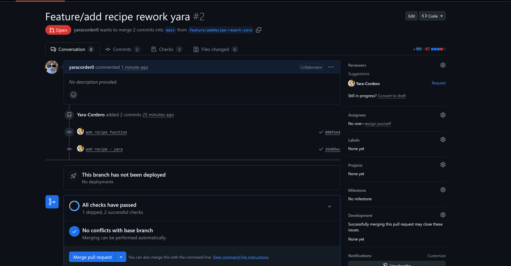
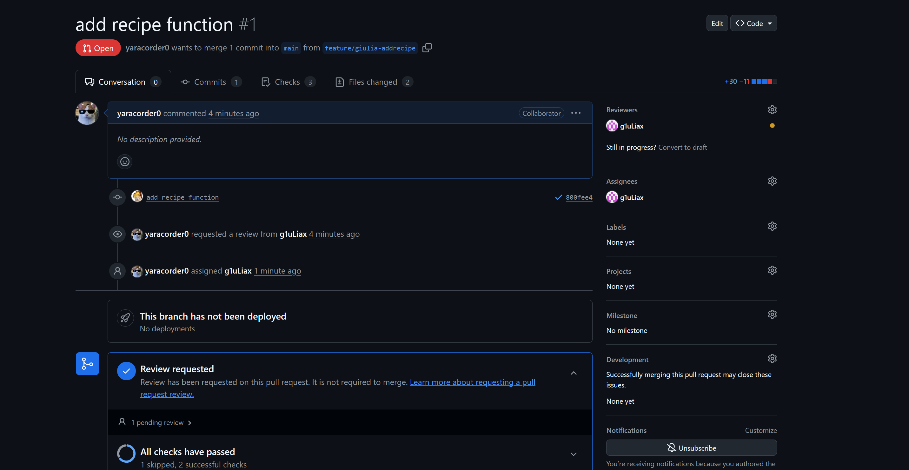
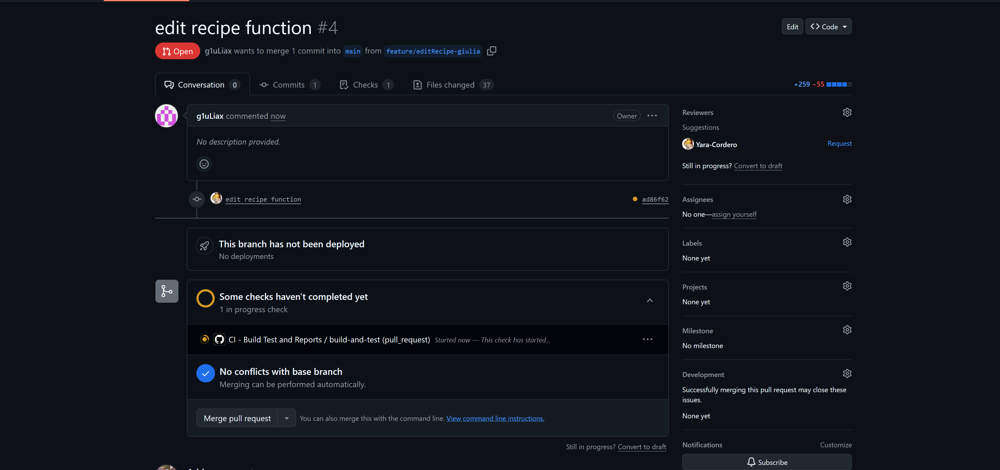
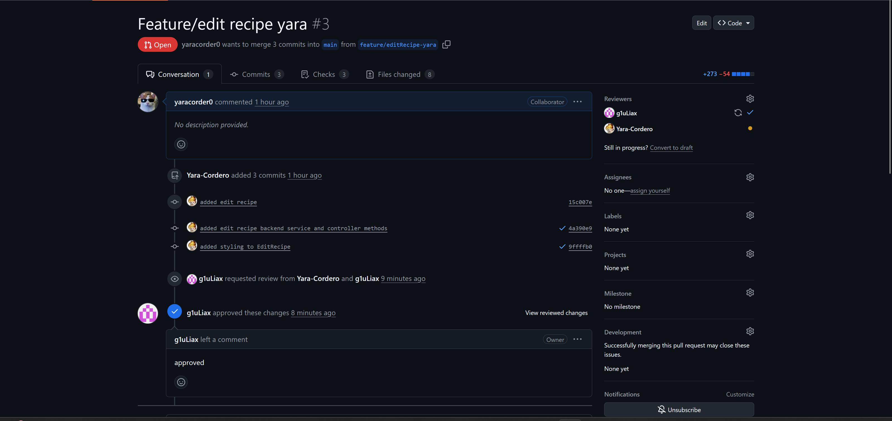

# Automation-Testing

## Finding 

What we found out about PR: 
- no unnecessary files (only code, not generated files)
- not changing structure of code (unless refactor)
- small changes (better overview)
- if not same feature (explanation of how to test)

## Aufgabe 1 

### Yara's PR 

The code is easy to understand and well structured, especially with the ingredient part separated into its own component.
I like that the form gives clear feedback to the user and the success animation is a nice extra.
The logic for adding, updating and removing ingredients makes sense and is implemented cleanly.
One thing that could be improved is using consistent naming for ingredient fields to avoid confusion.
I wish there were more comments to help understand the changes made to the files. 

### Giulia's PR

This is a really simple implementation of the feature, which I respect for its simplicity. It did not change many 
things from the original code, which makes it easier to understand. All in all, I am really satisfied with the changes made.

## Aufgabe 2

### Giulia's PR

This feature had to have more changes then the feature before in which I think the implementation is done very well. They only issue I have is with the commit of files which are not needed in the code base. These are the files which are created when starting/running the code locally. Nevertheless the code is implemented like needed and doesn't have any filler code.

### Yara's PR 

Yara added all the neccessary methods for the feature to update the implementation. The code was written according to the styleguide, even though we didnt really have a style guide it matches the structure of the other ocode pretty good. 

