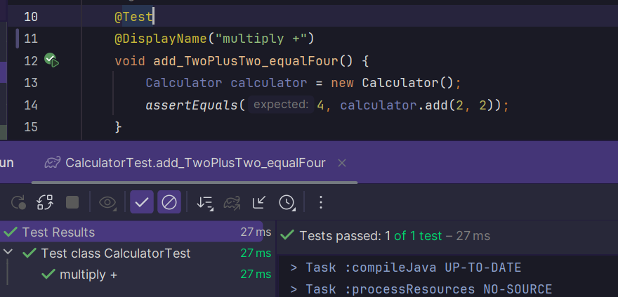

# Übung 2
JUnit5 is the standard framework for testing in Java.
Below are a few features listed with their usecases.

### @Test
with this annotation you can mark a function as a test function. This allows the user to run this unit test without having to run everything.

### @DisplayName("name")
This annotation allows the user to set a custom name for the testfunction.

### @BeforeAll
With this annotation you can define what should happen before a test gets run. Having this annotation in a test will have the function annotated with always be ran before the tests are run. It is basically a setUp function.
This tests only gets run once before all the tests.

### @BeforeEach
This annotation is very similar to @BeforeAll but it runs before every test, not just once.

### @AfterAll
The function annotated with this will be ran once after the tests are run. 

### @AfterEach
The function annotated with this will get run after each test.

### @TestFactory
This annotation doesnt create a test itself but it allows the user to create more dynamic tests, even though this was also possible with JUnit4, this annotation was added and allow to give a stream or a collection to a function during runtime.

### @Nested
This annotation allows us to have nested test functions.

## Sources
the pdf 2 from this link:
https://gitlab.com/ch-tbz-it/Stud/m450/m450/-/blob/main/Unterlagen/unit-testing/README.md

# Übung 3

Theres an abstract class Account and different types of Accounts which extend this class. The class Account is used very similar to how an interface or a parentclass would be used, except that it implements the functions like in a parentclass but it cant be instantiated on its own.
The Bank keeps a tree map of Accounts in the Bank. There are different methods to create each of the different types of accounts.

There is a method to book/withdraw from account which is linked to the Account. The BankUtils class is there to format different results